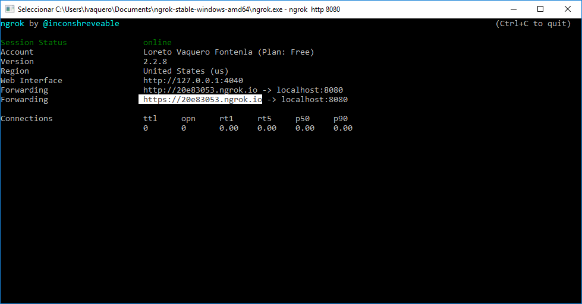
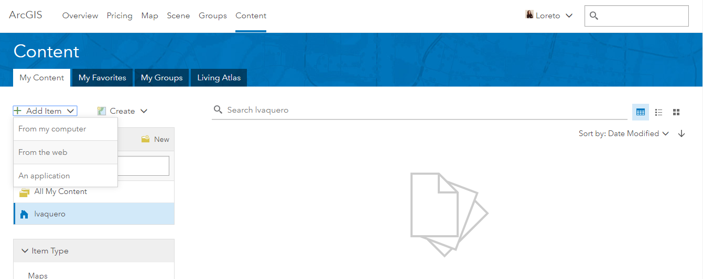
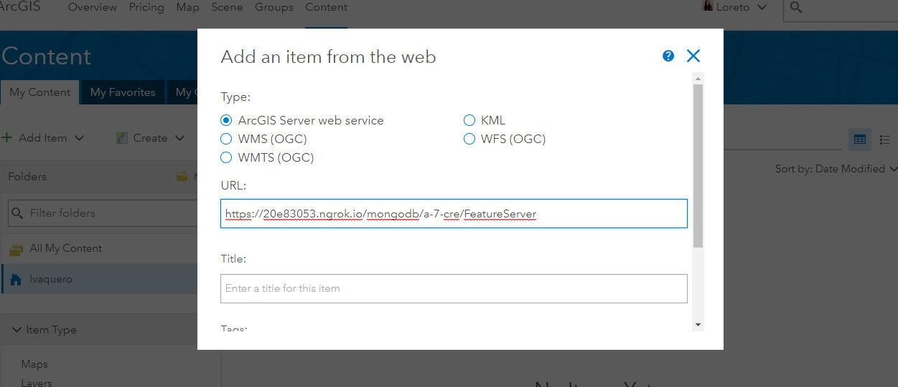

This is provider was created from the [koop-provider-sample](https://github.com/koopjs/koop-provider-sample) that demonstrates how to build a Koop Provider.

## Prerrequisites:
- [node.js](https://nodejs.org/es/)
- [mongoDB](https://docs.mongodb.com/manual/installation/)
- [**ngrok**](https://ngrok.com/): allows you to expose a web server running on your local machine to the internet. Just tell ngrok what port your web server is listening on.

## Files

| File | | Description |
| --- | --- | --- |
| `index.js` | Mandatory | Configures provider for usage by Koop |
| `model.js` | Mandatory | Translates remote API to GeoJSON |
| `routes.js` | Optional | Specifies additional routes to be handled by this provider |
| `controller.js` | Optional | Handles additional routes specified in `routes.js` |
| `server.js` | Optional | Reference implementation for the provider |
| `test/model-test.js` | Optional | tests the `getData` function on the model |
| `test/fixtures/input.json` | Optional | a sample of the raw input from the 3rd party API |
| `config/default.json` | Optional | used for advanced configuration, usually API keys. |


## Getting Started
The data source in this case is the DGT cameras.

http://localhost:8080/mongodb/:id/FeatureServer
1. Expose a local web server to the internet:
 1.  ngrok console UI
 ```sh
 $ ngrok http 8080
 ```

 1. Select https://
 

1. In ArcGIS Online:
   1. Log in
   1. Content > Add Item > From The Web

    

   1. Select **ArcGIS Server web service** and introduce the **url** of the service.
   The **url** will be, the random url from ngrok plus service name from koop provider.

    

    Add title and tags
    1. Check: Open in Map Viewer


## Resources
- https://koopjs.github.io/
- https://dashboard.ngrok.com/get-started/
- https://mongodb.github.io/node-mongodb-native/
