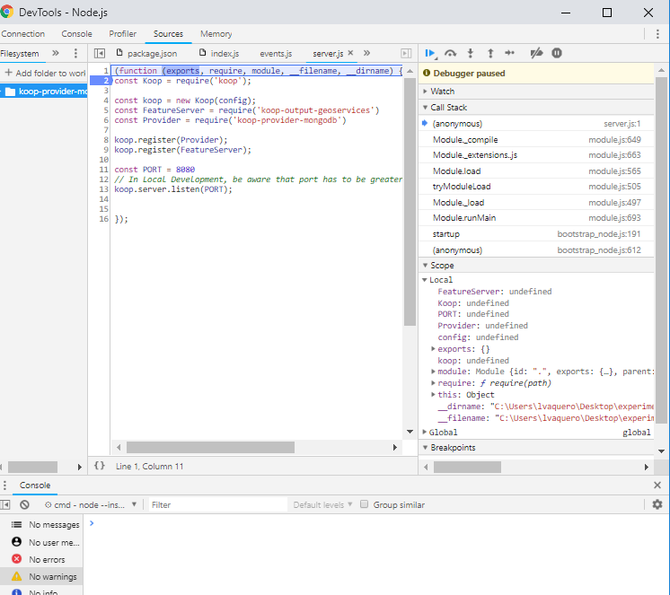

# koop-provider-mongodb

This provider accesses a collection of documents in MongoDB, which translate into GeoJSON and Geoserviceslater.

This is provider was created from the [koop-provider-sample](https://github.com/koopjs/koop-provider-sample) that demonstrates how to build a Koop Provider.

## Required:
- [node.js](https://nodejs.org/es/)
- [mongoDB](https://docs.mongodb.com/manual/installation/)

## Install
To install/use this provider you first need a working installation of [Koop](https://github.com/Esri/koop). For information on using Koop, see https://github.com/esri/koop.

## Getting started

1. Create a directory:
```sh
$ cd ~/Desktop
$ mkdir my_project
$ cd my_project
```
1. To execute in the project:
```sh
$ npm init -y
```
*npm init -y: generate the package.json file with default options (without asking any questions)*

1. Create `server.js` and add content:

  ```sh
  $ touch server.js
  ```

  ```js

  process.on('SIGINT', () => process.exit(0))
  process.on('SIGTERM', () => process.exit(0))

  const Koop = require('koop')
  const koop = new Koop()

  const config = require('config')

  const provider = require('./index.js')
  koop.register(provider)

  const PORT = 8080
  koop.server.listen(PORT);

  ```

1. Create configuration:

 ```sh
$ mkdir config
$ cd config
$ touch default.json
```

1. Fill default.json with proper data
 ```js
{
  "mongodb": {
    "url": MongoDB connection string,
    "databasename": Database name,
    "collectionname": Collection name,
    "field_id": Request field (:id),
    "latitude": Latitude field database,
    "longitude":Longitude field database,
    "projectObj":fields to return in the documents that match the query filter.
    }
}
```

1. Install dependencies:

  ```sh
  $ npm i koop
  $ npm i koop-provider-mongodb
  ```

1. Start

  ```sh
  node server.js
  ```
1. If you need to debug it

  ```sh
  node --inspect-brk server.js
  ```


## Usage

By default, Koop will start listening on http://localhost:8080.

You can issue a request by using:

```sh
$ curl http://localhost:8080/mongodb/:id/FeatureServer0/query
```

Any query-parameters added to the request URL can accessed within getData and leveraged for data fetching purposes.

## Example

If you need to check some example, you can visit the [repository](https://github.com/VaqueroFontenla/koop-provider-mongodb.git)

## Resources
- http://koopjs.github.io/
- https://github.com/koopjs/koop-provider-file-geojson
- https://github.com/koopjs/koop-provider-sample.git
